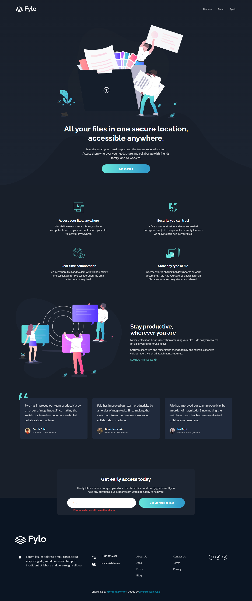

# Frontend Mentor - Fylo dark theme landing page solution

This is a solution to the [Fylo dark theme landing page challenge on Frontend Mentor](https://www.frontendmentor.io/challenges/fylo-dark-theme-landing-page-5ca5f2d21e82137ec91a50fd). Frontend Mentor challenges help you improve your coding skills by building realistic projects.

## Table of contents

- [Overview](#overview)
  - [Screenshot](#screenshot)
  - [Live Site](#livesite)
  - [Built with](#built-with)
- [Author](#author)

## Overview

### Screenshot

### Live Site

[Click Here](https://lustrous-alpaca-18d858.netlify.app//)

### Built with

- Semantic HTML5 markup
- Tailwind CSS Framework
- CSS Flexbox and Grid
- JS

## Author

- Amir Hossein Azizi
- Frontend Mentor - [@amirhazizi](https://www.frontendmentor.io/profile/amirhazizi)
